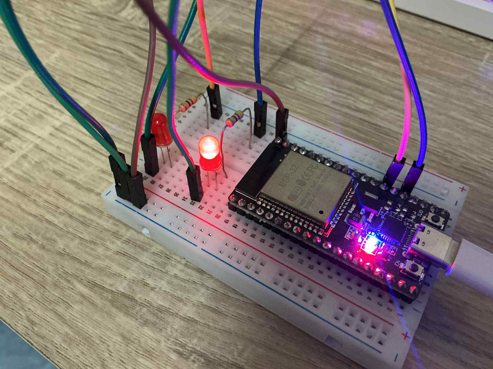
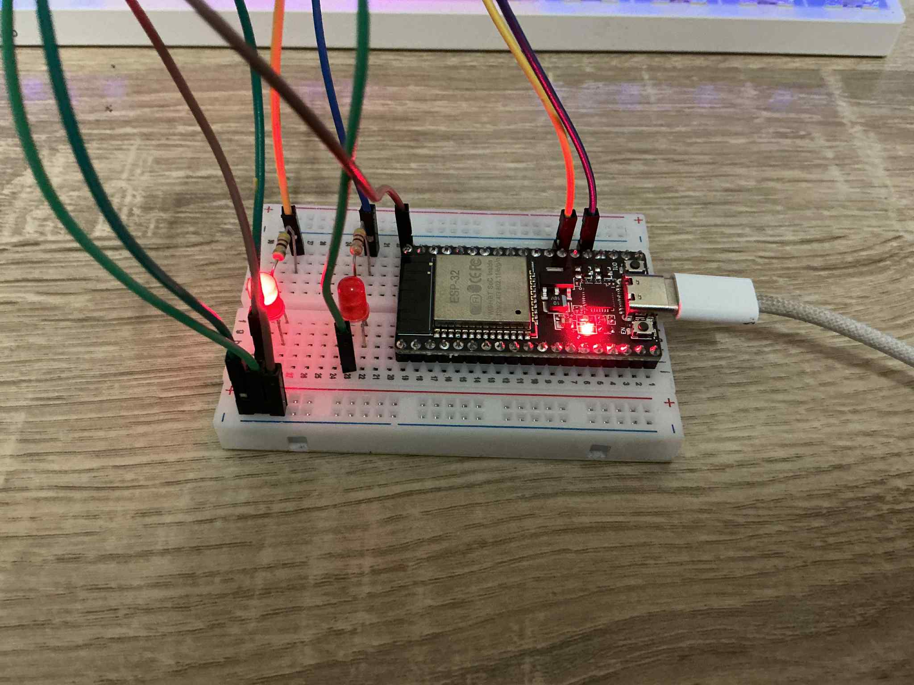

## รูปภาพ

## การทดสอบ

1. **ทดสอบ Single Task**:
   - สังเกตการทำงานของ LED
   - กดปุ่มและสังเกตเวลาตอบสนอง
   - บันทึกเวลาตอบสนองเมื่อกดปุ่ม

2. **ทดสอบ Multitasking**:
   - สังเกตการทำงานของ LED (ทำงานพร้อมกัน)
   - กดปุ่มและสังเกตเวลาตอบสนอง
   - เปรียบเทียบกับระบบ Single Task

## คำถามสำหรับวิเคราะห์

1.  **ความแตกต่างในการตอบสนองปุ่มระหว่างทั้งสองระบบคืออะไร?**
    - **Single Task System:** การตอบสนองต่อการกดปุ่มจะช้ามาก (Delayed response) เพราะโปรแกรมต้องทำงานอื่น ๆ (เช่น การจำลองอ่านเซ็นเซอร์, การประมวลผลหนัก, และการควบคุม Actuator) ให้เสร็จสิ้นในรอบนั้นก่อน จึงจะวนกลับมาตรวจสอบสถานะของปุ่มได้
    - **Multitasking System:** การตอบสนองจะเกิดขึ้นแทบจะทันที (Immediate response) เนื่องจาก `emergency_task` ซึ่งทำหน้าที่ตรวจสอบปุ่ม ถูกกำหนดให้มี Priority สูงสุด ทำให้ FreeRTOS Scheduler สามารถหยุดการทำงานของ Task อื่นที่มี Priority ต่ำกว่าชั่วคราว แล้วสลับมาทำงานที่ `emergency_task` ก่อนได้ทันทีเมื่อถึงเวลา

2.  **ใน Single Task System งานไหนที่ทำให้การตอบสนองล่าช้า?**
    - งานที่ทำให้เกิดความล่าช้ามากที่สุดคือ **Task 2: Process data (heavy computation)** ซึ่งมีการวนลูปถึง 1,000,000 ครั้ง และ **Task 1: Blink LED1** กับ **Task 3: Control LED2** ที่มีการใช้ `vTaskDelay` เป็นเวลานาน (รวมกันมากกว่า 1.6 วินาที) งานเหล่านี้เป็น "Blocking" คือขัดขวางไม่ให้โปรแกรมทำงานส่วนอื่นต่อไปได้จนกว่าจะทำเสร็จ

3.  **ข้อดีของ Multitasking System ที่สังเกตได้คืออะไร?**
    - **การตอบสนองที่ดีเยี่ยม (Responsiveness):** ระบบสามารถจัดการกับเหตุการณ์เร่งด่วน (การกดปุ่มฉุกเฉิน) ได้อย่างรวดเร็ว โดยไม่ถูกขัดขวางจากงานอื่นที่ใช้เวลานาน
    - **การทำงานพร้อมกัน (Concurrency):** แม้จะมี CPU เพียงคอร์เดียว แต่ Task ต่างๆ สามารถทำงานสลับไปมาได้อย่างรวดเร็วจนดูเหมือนว่าทำงานพร้อมกันได้ (เช่น LED ทั้งสองดวงกระพริบในเวลาเดียวกัน) ทำให้ใช้ประโยชน์จาก CPU ได้อย่างเต็มประสิทธิภาพมากขึ้น
    - **การจัดลำดับความสำคัญ (Prioritization):** สามารถกำหนดความสำคัญของงานแต่ละอย่างได้ ทำให้มั่นใจได้ว่างานที่สำคัญที่สุดจะถูกประมวลผลก่อนเสมอ

4.  **มีข้อเสียของ Multitasking System ที่สังเกตได้หรือไม่?**
    - **ความซับซ้อนที่เพิ่มขึ้น (Increased Complexity):** การเขียนโค้ดมีความซับซ้อนกว่าเดิม ต้องจัดการ Task หลายตัว, จัดการ Priority, และอาจต้องรับมือกับปัญหาการเข้าถึงข้อมูลที่ใช้ร่วมกัน (Shared Resources) ในอนาคต
    - **การใช้ทรัพยากรมากขึ้น (Resource Overhead):** แต่ละ Task ต้องการหน่วยความจำสำหรับ Stack ของตัวเอง (ในตัวอย่างคือ 2048 bytes ต่อ task) และตัว Scheduler ของ RTOS เองก็ต้องใช้เวลา CPU ส่วนหนึ่งในการสลับการทำงานของ Task ต่างๆ