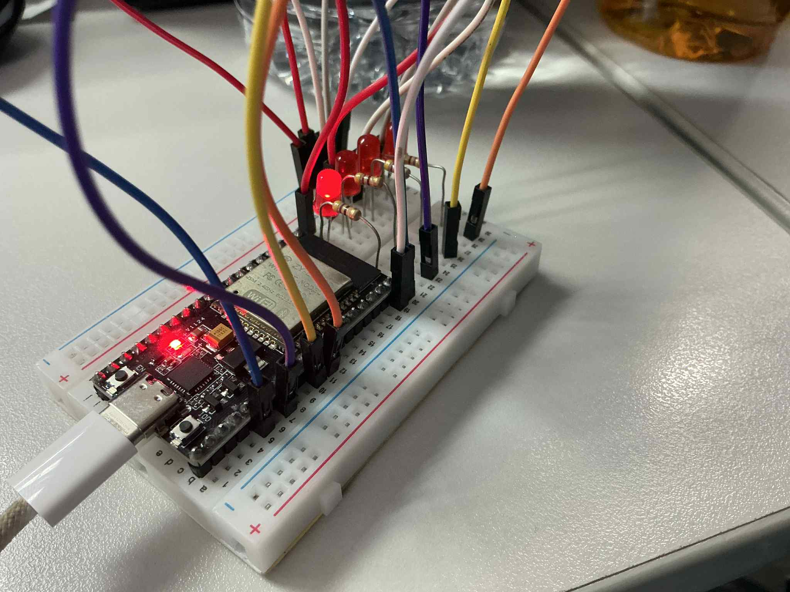

## รูปภาพ

## คำถามทบทวน

1.  **Priority ไหนทำงานมากที่สุด? เพราะอะไร?**
    *   Task ที่มี Priority สูงที่สุดและอยู่ในสถานะ "Ready" (พร้อมทำงาน) จะได้ทำงานก่อนเสมอ เนื่องจาก FreeRTOS ใช้ระบบจัดตารางงานแบบ Priority-based Preemptive Scheduling ซึ่งหมายความว่า Task ที่มีลำดับความสำคัญสูงกว่าจะสามารถเข้ามาขัดจังหวะ (preempt) การทำงานของ Task ที่มีลำดับความสำคัญต่ำกว่าได้ทันทีที่มันพร้อมจะทำงาน

2.  **เกิด Priority Inversion หรือไม่? จะแก้ไขได้อย่างไร?**
    *   **Priority Inversion** สามารถเกิดขึ้นได้ในระบบนี้ Priority Inversion คือสถานการณ์ที่ Task ที่มีความสำคัญสูงถูกหน่วงการทำงานโดย Task ที่มีความสำคัญต่ำกว่าทางอ้อม ซึ่งมักเกิดขึ้นเมื่อ Task ที่มีความสำคัญต่ำกำลังถือครองทรัพยากร (เช่น Mutex) ที่ Task ที่มีความสำคัญสูงต้องการอยู่ และในขณะนั้นมี Task ที่มีความสำคัญปานกลาง (ที่ไม่ต้องการทรัพยากรนั้น) เข้ามาทำงานแทน ทำให้ Task ที่มีความสำคัญสูงต้องรอให้ Task ที่มีความสำคัญปานกลางทำงานเสร็จก่อน
    *   **วิธีแก้ไข:** วิธีที่นิยมใช้ใน FreeRTOS คือการใช้ **Mutex ที่มีคุณสมบัติ Priority Inheritance** เมื่อ Task ที่มีความสำคัญสูงพยายามเข้าถึง Mutex ที่ถูกถือครองโดย Task ที่มีความสำคัญต่ำกว่า, Scheduler ของ FreeRTOS จะทำการ "สืบทอด" Priority โดยจะเพิ่ม Priority ของ Task ที่มีความสำคัญต่ำนั้นให้สูงเท่ากับ Priority ของ Task ที่กำลังรออยู่ชั่วคราว เพื่อให้ Task ที่มีความสำคัญต่ำทำงานใน critical section ให้เสร็จและปล่อย Mutex โดยเร็วที่สุด ป้องกันไม่ให้ Task ที่มีความสำคัญปานกลางเข้ามาขัดจังหวะได้

3.  **Tasks ที่มี priority เดียวกันทำงานอย่างไร?**
    *   Tasks ที่มี Priority เท่ากันจะทำงานสลับกันไปมาในลักษณะที่เรียกว่า **Time Slicing** หรือ **Round-Robin Scheduling** โดย Scheduler จะจัดสรรเวลา (time slice) ให้แต่ละ Task ทำงาน เมื่อ Task หนึ่งใช้เวลาของตัวเองจนหมด Scheduler ก็จะสลับไปให้ Task อื่นที่มี Priority เดียวกันทำงานต่อไป วนไปเรื่อยๆ ทำให้ดูเหมือนว่า Tasks เหล่านั้นทำงานไปพร้อมๆ กัน

4.  **การเปลี่ยน Priority แบบ dynamic ส่งผลอย่างไร?**
    *   การเปลี่ยน Priority ของ Task แบบไดนามิก (โดยใช้ฟังก์ชัน `vTaskPrioritySet()`) จะส่งผลต่อลำดับการทำงานของ Scheduler ทันที หากเราเพิ่ม Priority ของ Task ให้สูงขึ้น มันอาจจะเข้าไปขัดจังหวะการทำงานของ Task อื่นที่กำลังทำงานอยู่ (ถ้า Task ที่ถูกเปลี่ยน Priority อยู่ในสถานะ Ready) ในทางกลับกัน หากเราลด Priority ลง Task นั้นก็อาจจะถูก Task อื่นที่มี Priority สูงกว่าเข้ามาทำงานแทน การทำเช่นนี้มีประโยชน์ในการปรับเปลี่ยนพฤติกรรมของระบบตามสถานการณ์ เช่น การเพิ่มความสำคัญของ Task ที่ต้องจัดการกับข้อมูลเร่งด่วนชั่วคราว

5.  **CPU utilization ของแต่ละ priority เป็นอย่างไร?**
    *   CPU utilization (อัตราการใช้งาน CPU) ไม่ได้ขึ้นอยู่กับระดับ Priority เพียงอย่างเดียว แต่ขึ้นอยู่กับ **"พฤติกรรมการทำงานของ Task"** เป็นหลัก
    *   Task ที่มี Priority สูง แต่ใช้เวลาส่วนใหญ่ไปกับการ "รอ" (เช่น `vTaskDelay` หรือรอ event) จะมี CPU utilization ที่ต่ำ
    *   ในทางกลับกัน Task ที่มี Priority ต่ำ แต่มีการประมวลผลหนักๆ ตลอดเวลา (ไม่ค่อยเข้าสู่สถานะ Blocked) จะมี CPU utilization ที่สูง แต่จะได้ใช้ CPU ก็ต่อเมื่อไม่มี Task ที่มี Priority สูงกว่าพร้อมทำงานอยู่เลย
    *   ใน FreeRTOS สามารถใช้ฟังก์ชัน `vTaskGetRunTimeStats()` เพื่อเก็บและวิเคราะห์ข้อมูลสถิติการทำงานของแต่ละ Task เพื่อดูว่า Task ไหนใช้เวลา CPU ไปเท่าไหร่