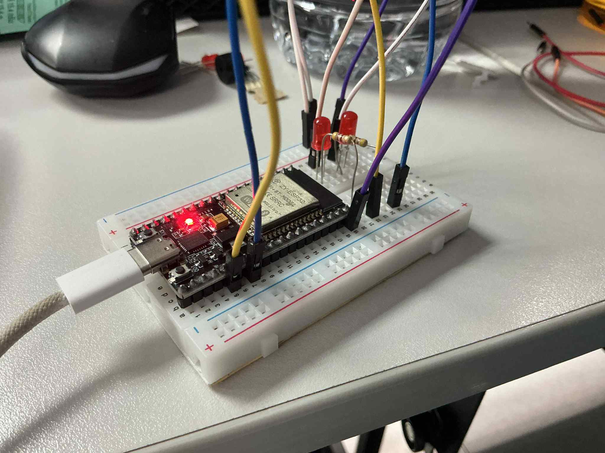

## รูปภาพ

## คำถามทบทวน

1.  **Task ไหนใช้ stack มากที่สุด? เพราะอะไร?**
    *   โดยทั่วไปแล้ว Task ที่ใช้หน่วยความจำ Stack มากที่สุด คือ Task ที่มีลักษณะการทำงานอย่างใดอย่างหนึ่งต่อไปนี้:
        *   **มีการเรียกฟังก์ชันซ้อนกันหลายชั้น (Deep Function Call Chains):** ยิ่งเรียกฟังก์ชันต่อๆ กันไปลึกเท่าไหร่ ก็ยิ่งต้องใช้ Stack ในการเก็บ Return Address และ Context มากขึ้นเท่านั้น
        *   **มีการประกาศตัวแปร Local ขนาดใหญ่:** การประกาศตัวแปร Array หรือ Struct ที่มีขนาดใหญ่ภายในฟังก์ชัน จะเป็นการจองพื้นที่บน Stack โดยตรง
        *   **มีการใช้ Recursion:** ฟังก์ชันที่เรียกตัวเองซ้ำๆ จะสร้าง Stack Frame ใหม่ในทุกๆ การเรียก ทำให้ Stack โตขึ้นอย่างรวดเร็ว
        *   **มีการเรียกใช้ฟังก์ชันที่ซับซ้อน:** เช่น การเรียกใช้ฟังก์ชัน `printf` ที่มีการ format ข้อความซับซ้อน ก็อาจต้องการพื้นที่ Stack จำนวนมาก

2.  **การใช้ heap แทน stack มีข้อดีอย่างไร?**
    *   การใช้ Heap (การจองหน่วยความจำแบบไดนามิกผ่าน `malloc`/`pvPortMalloc`) แทนที่ Stack (การประกาศตัวแปร Local) มีข้อดีหลักๆ ดังนี้:
        *   **เหมาะสำหรับข้อมูลขนาดใหญ่:** Heap เหมาะสำหรับการจองหน่วยความจำที่มีขนาดใหญ่มากๆ ซึ่งหากจองบน Stack อาจทำให้เกิด Stack Overflow ได้ง่าย
        *   **ควบคุมอายุการใช้งานได้ (Lifetime Control):** ข้อมูลที่จองบน Heap จะยังคงอยู่จนกว่าจะมีการสั่ง `free`/`vPortFree` ทำให้สามารถใช้ข้อมูลนั้นข้ามขอบเขตของฟังก์ชัน (scope) หรือแชร์ข้อมูลระหว่าง Task ได้ ซึ่งต่างจากข้อมูลบน Stack ที่จะถูกทำลายทิ้งทันทีที่ฟังก์ชันทำงานเสร็จ
        *   **ความยืดหยุ่น:** สามารถกำหนดขนาดของหน่วยความจำที่ต้องการในขณะที่โปรแกรมทำงาน (Runtime) ได้

3.  **Stack overflow เกิดขึ้นเมื่อไหร่และทำอย่างไรป้องกัน?**
    *   **Stack Overflow เกิดขึ้นเมื่อ:** Task พยายามใช้หน่วยความจำ Stack เกินกว่าขนาดที่ได้รับการจัดสรรไว้ ทำให้ Stack Pointer ชี้ไปยังพื้นที่หน่วยความจำนอกขอบเขตของตนเอง และเขียนข้อมูลทับลงบนหน่วยความจำของ Task อื่นหรือของระบบปฏิบัติการ ซึ่งนำไปสู่การทำงานที่ผิดพลาดอย่างร้ายแรง, ข้อมูลเสียหาย, หรือระบบแครช
    *   **วิธีป้องกัน:**
        1.  **กำหนดขนาด Stack ให้เพียงพอ:** วิเคราะห์และประเมินการใช้งาน Stack ของ Task และกำหนดขนาดให้มีขนาดใหญ่เพียงพอต่อการใช้งานในสถานการณ์ที่เลวร้ายที่สุด
        2.  **ตรวจสอบการใช้งาน Stack:** ใช้ฟังก์ชัน `uxTaskGetStackHighWaterMark()` ของ FreeRTOS เพื่อตรวจสอบดูว่า Task ใช้ Stack เข้าใกล้ขนาดที่กำหนดไว้มากน้อยเพียงใด (ค่ายิ่งน้อยแปลว่ายิ่งใกล้จะเต็ม) เพื่อนำมาปรับจูนขนาดให้เหมาะสม
        3.  **หลีกเลี่ยงตัวแปร Local ขนาดใหญ่:** หากจำเป็นต้องใช้ Array หรือ Struct ขนาดใหญ่ ควรเปลี่ยนไปจองหน่วยความจำบน Heap แทน
        4.  **จำกัดความลึกของ Recursion:** หลีกเลี่ยงการออกแบบที่ต้องเรียกใช้ฟังก์ชันตัวเองซ้ำๆ เป็นจำนวนมาก

4.  **การตั้งค่า stack size ควรพิจารณาจากอะไร?**
    *   ในการพิจารณาเพื่อตั้งค่าขนาด Stack ของ Task ควรคำนึงถึงปัจจัยเหล่านี้:
        *   **ความลึกของการเรียกฟังก์ชัน (Function Call Depth):** Task มีการเรียกฟังก์ชันซ้อนกันลึกที่สุดกี่ชั้น
        *   **ขนาดของตัวแปร Local และพารามิเตอร์:** ผลรวมของขนาดตัวแปรทั้งหมดที่ถูกสร้างขึ้นในทุกฟังก์ชันที่ Task เรียกใช้
        *   **Context ของ CPU และการจัดการ Interrupt:** พื้นที่ที่ต้องใช้ในการบันทึกสถานะของ CPU เมื่อมีการสลับ Task หรือเมื่อเกิด Interrupt
        *   **การใช้งานไลบรารี:** ฟังก์ชันจากไลบรารีมาตรฐาน (เช่น `stdio.h`) หรือไลบรารีอื่นๆ ที่ Task เรียกใช้ อาจต้องการพื้นที่ Stack เพิ่มเติม
    *   **แนวทางปฏิบัติ:** คือการเริ่มต้นด้วยการกำหนดขนาดที่คิดว่ามากเพียงพอ จากนั้นทำการทดสอบระบบในสภาวะที่ใช้งานหนักที่สุด แล้วใช้ `uxTaskGetStackHighWaterMark()` เพื่อหาขนาดที่เหมาะสมและปลอดภัย

5.  **Recursion ส่งผลต่อ stack usage อย่างไร?**
    *   Recursion (ฟังก์ชันที่เรียกตัวเอง) ส่งผลกระทบโดยตรงและรุนแรงต่อการใช้ Stack **ทุกครั้งที่ฟังก์ชันเรียกตัวเอง จะมีการสร้าง Stack Frame ใหม่**เพื่อเก็บข้อมูลต่างๆ เช่น Local Variables, Function Parameters, และ Return Address ซ้อนทับลงบน Stack ไปเรื่อยๆ หากการเรียกซ้ำมีความลึกมาก (Deep Recursion) หรือไม่มีเงื่อนไขการหยุดที่ถูกต้อง (Termination Condition) จะทำให้ Stack ถูกใช้จนหมดอย่างรวดเร็ว และเป็นหนึ่งในสาเหตุที่พบบ่อยที่สุดของ Stack Overflow