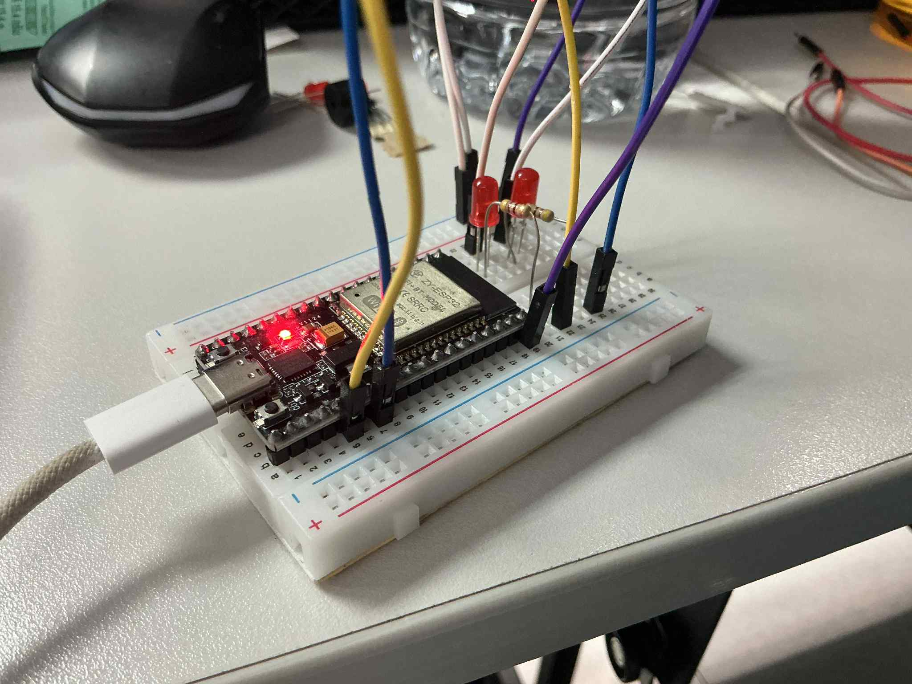
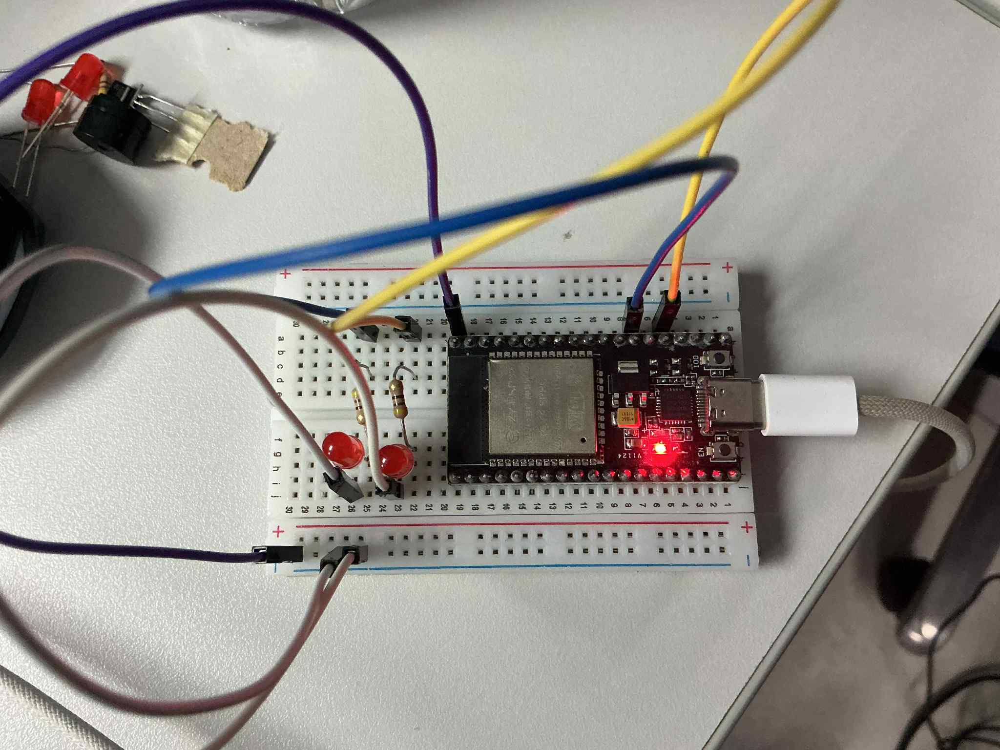
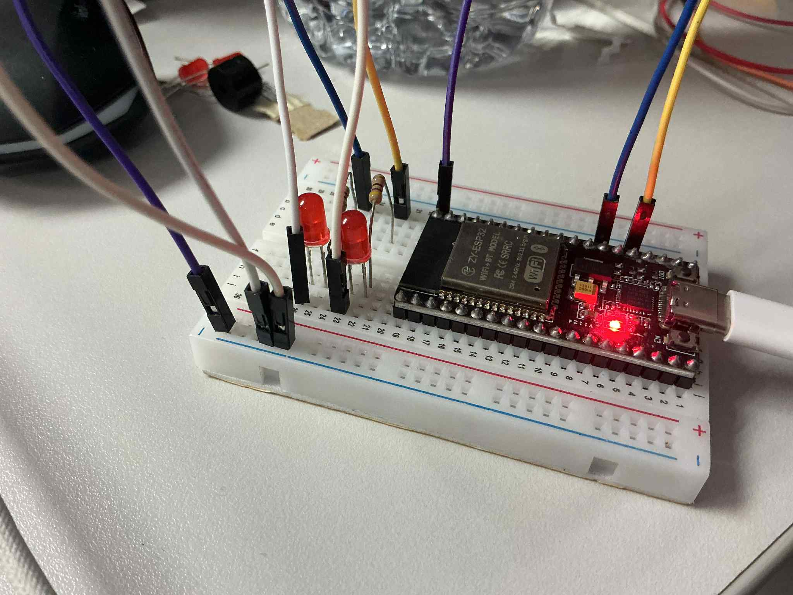

## รูปภาพ

## 🚀 แนวทางสำหรับความท้าทายเพิ่มเติม

### 1. Priority Queue: ปรับปรุงให้ข้อความมี Priority

*   **แนวทาง:** สามารถทำได้ 2 วิธีหลัก
    1.  **ใช้ `xQueueSendToFront()`:** สำหรับข้อความเร่งด่วน ให้ใช้ฟังก์ชันนี้แทน `xQueueSend()` ข้อความนั้นจะถูกแทรกเข้าไปอยู่หน้าสุดของคิว ทำให้ผู้รับได้รับเป็นลำดับถัดไปทันที เป็นวิธีที่ง่ายที่สุด
    2.  **ใช้หลาย Queues:** สร้าง Queue ขึ้นมา 2 ตัวแยกกันสำหรับ High-priority และ Normal-priority จากนั้นฝั่งผู้รับจะต้องเขียน Logic ให้ตรวจสอบและเคลียร์ข้อความจาก High-priority Queue ให้หมดก่อนเสมอ ถึงจะไปอ่านข้อความจาก Normal-priority Queue วิธีนี้ให้การรับประกันลำดับความสำคัญที่ชัดเจนกว่า

### 2. Multiple Senders: เพิ่ม Sender หลายตัว

*   **แนวทาง:** FreeRTOS Queues ถูกออกแบบมาให้เป็น **Thread-Safe** อยู่แล้ว หมายความว่าเราสามารถสร้าง Task ผู้ส่ง (Producer/Sender) กี่ตัวก็ได้ให้เขียนข้อมูลลงใน Queue เดียวกันโดยที่ข้อมูลไม่เสียหาย
*   **วิธีทำ:** เพียงแค่สร้าง Task ผู้ส่งขึ้นมาหลายๆ Task และส่ง `QueueHandle_t` ของ Queue ตัวเดียวกันไปให้ทุก Task เพื่อใช้ในการเรียก `xQueueSend()` FreeRTOS จะจัดการการเข้าถึงทรัพยากรภายในให้เอง

### 3. Queue Statistics: เพิ่มการนับ dropped messages

*   **แนวทาง:** "Dropped Message" คือข้อความที่ส่งไม่สำเร็จเพราะ Queue เต็ม การจะนับได้ เราต้องส่งข้อมูลแบบไม่รอ (Non-blocking)
*   **วิธีทำ:** ใน Task ผู้ส่ง ให้เรียกใช้ `xQueueSend()` โดยกำหนดพารามิเตอร์ `xTicksToWait` เป็น `0` จากนั้นตรวจสอบค่าที่ฟังก์ชันส่งกลับมา
    *   ถ้าได้ค่าเป็น `pdFALSE` หมายความว่าส่งไม่สำเร็จ (คิวเต็ม) ให้เราบวกค่าตัวแปรที่สร้างขึ้นมาเพื่อนับ `dropped_message_count`
    *   ถ้าได้ค่าเป็น `pdTRUE` คือส่งสำเร็จ

### 4. Dynamic Queue Size: ทดลองขนาด Queue ต่างๆ

*   **แนวทาง:** เราไม่สามารถเปลี่ยนขนาด Queue ขณะที่โปรแกรมทำงานได้ แต่ "การทดลอง" ในที่นี้คือการปรับค่า `uxQueueLength` (จำนวน item สูงสุด) ตอนที่สร้าง Queue ด้วย `xQueueCreate()` แล้วคอมไพล์ใหม่เพื่อดูผลกระทบ
*   **สิ่งที่ต้องพิจารณา:**
    *   **Queue ขนาดเล็ก:** ประหยัด RAM แต่ถ้าผู้ส่งทำงานเร็วกว่าผู้รับ จะทำให้ผู้ส่ง Block บ่อย หรือถ้าส่งแบบ Non-blocking ก็จะเกิด Dropped Messages ได้ง่าย
    *   **Queue ขนาดใหญ่:** ใช้ RAM เยอะขึ้น แต่สามารถรองรับปริมาณข้อมูลที่เข้ามาพร้อมกันเยอะๆ (bursts) ได้ดีกว่า ลดโอกาสที่ผู้ส่งจะ Block
*   **เป้าหมาย:** คือการหาขนาดที่สมดุล โดยอาจใช้ `uxQueueSpacesAvailable()` เพื่อคอยตรวจสอบระหว่างการทดสอบว่า Queue ใกล้เต็มบ่อยแค่ไหน เพื่อหาขนาดที่เหมาะสมที่สุดสำหรับแอปพลิเคชันนั้นๆ